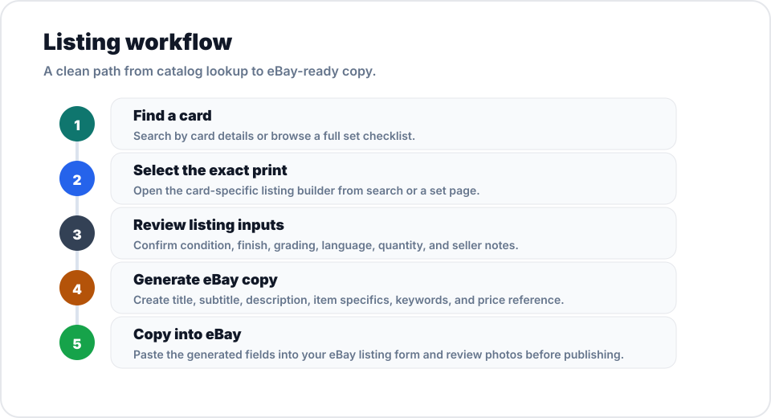

<p align="center">
  
</p>

<p align="center">
  <a href="https://github.com/LiamSx45/poke-ebay-web-admin">
    
  </a>
  
  
  
  
</p>

# Pokemon eBay Web Admin

A routed Next.js admin dashboard for turning Pokemon TCG card metadata into eBay listing copy.

Search cards, browse set logos, open full set checklists, and generate listing-ready titles, descriptions, item specifics, keywords, and price references from a selected card.

## Command Center

| Area | What it does |
| --- | --- |
| Card Search | Find cards by name, set, number, rarity, or type |
| Set Browser | Browse the Pokemon TCG catalog by logo and series |
| Set Detail | View complete set checklists with all cards |
| Listing Builder | Generate eBay title, subtitle, description, specifics, and price reference |
| Local Data Index | Uses a synced compact index from `PokemonTCG/pokemon-tcg-data` |

## Listing Workflow

<p align="center">
  
</p>

## Routes

| Route | Page |
| --- | --- |
| `/` | Dashboard overview |
| `/search` | Search cards and sort results |
| `/sets` | Browse sets by logo |
| `/sets/[setId]` | View every card in a set |
| `/listing?card=base1-4` | Build an eBay listing for a card |
| `/api/cards` | Search cards, filter by set, or look up a card id |
| `/api/sets` | Read the synced set catalog |

## Listing Output

The builder creates:

- eBay title with an 80-character target
- Subtitle
- Description
- Item specifics
- Suggested price reference from available TCGplayer market data
- Search keywords

Generated copy should still be reviewed against your photos, condition, grading, and eBay category requirements before publishing.

## Stack

| Package | Version |
| --- | --- |
| Next.js | `16.2.4` |
| React | `19.2.5` |
| TypeScript | `6.0.3` |
| ESLint | `9.39.4` |
| Lucide React | `1.14.0` |

## Quick Start

```bash
npm install
npm run sync:cards
npm run dev
```

Open [http://localhost:3000](http://localhost:3000).

## Data Pipeline

The app syncs card and set metadata from the public [`PokemonTCG/pokemon-tcg-data`](https://github.com/PokemonTCG/pokemon-tcg-data) repository.

```bash
npm run sync:cards
```

The sync script writes:

```text
data/cards-index.json
```

That file is committed so the app works immediately after cloning. Run the sync command whenever you want to refresh against upstream Pokemon TCG data.

## Scripts

| Command | Description |
| --- | --- |
| `npm run dev` | Start the local Next.js dev server |
| `npm run build` | Create a production build |
| `npm run start` | Run the production server |
| `npm run lint` | Run ESLint |
| `npm run sync:cards` | Fetch and rebuild the local Pokemon card index |

## Project Map

```text
app/
  api/
    cards/          Card search and lookup API
    sets/           Set catalog API
  components/       Admin shell, cards, sets, and listing UI
  lib/              Card types, search, and listing generation
  listing/          Listing builder route
  search/           Card search route
  sets/             Set browser and set detail routes
data/
  cards-index.json  Synced Pokemon TCG card index
public/
  product-flow.svg  README workflow diagram
  readme-banner.svg README banner artwork
scripts/
  sync-cards.mjs    GitHub data sync script
```

## Deploy

This is a standard Next.js app and can be deployed anywhere that supports Next.js, including Vercel.

For hosted deployments, keep `data/cards-index.json` committed or run `npm run sync:cards` during your build process if network access is available.

## Repository

[github.com/LiamSx45/poke-ebay-web-admin](https://github.com/LiamSx45/poke-ebay-web-admin)
